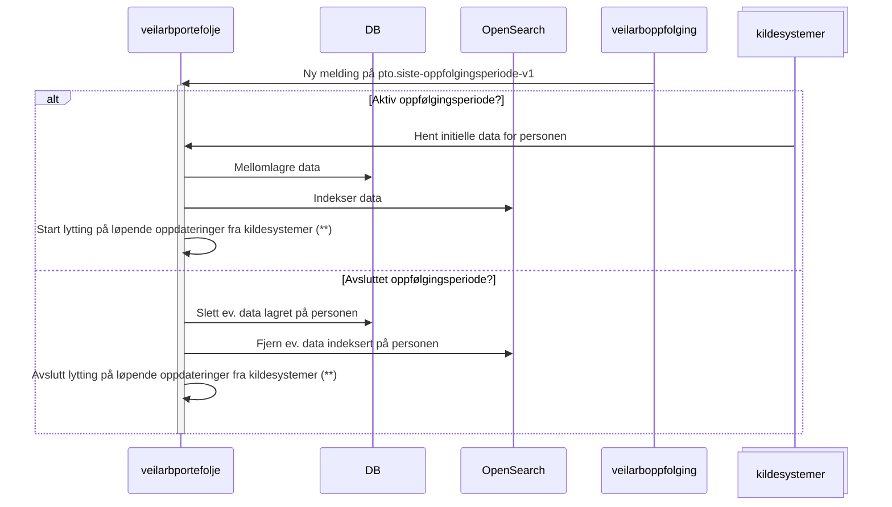

# Populasjon

I veilarbportefolje lagres og behandles data om norske innbyggere som får
[arbeidsrettet oppfølging](https://navno.sharepoint.com/sites/begreper/SitePages/Begrep.aspx?bid=BEGREP-804). Når en
person er under arbeidsrettet oppfølging har hen en aktiv
[oppfølgingsperiode](https://navno.sharepoint.com/sites/begreper/SitePages/Begrep.aspx?bid=BEGREP-1607). En person kan
videre ha flere oppfølgingsperioder, og kan derfor være innom veilarportefolje på ulike tidspunkt. Følgende kriterie
styrer hvilke personer som er en del av populasjonen: **personer med en folkeregisterident som har en aktiv
arbeidsoppfølgingsperiode**.

## Implementasjon

Tjenesten [veilarboppfolging](https://github.com/navikt/veilarboppfolging) er master for personer som er under
arbeidsrettet oppfølging. Per dags dato får veilarbportefolje informasjon om oppfølgingsperioder fra Kafka-topicet
`pto.siste-oppfolgingsperiode-v1`.

### Beskrivelse

Her følger en overordnet stegvis beskrivelse av hvordan implementasjonen er per dags dato (*):

| Steg | Beskrivelse                                                                                                                                                                                                                                                               | Relevant kode                                                                                                                                                                                                                                                     |
|------|---------------------------------------------------------------------------------------------------------------------------------------------------------------------------------------------------------------------------------------------------------------------------|-------------------------------------------------------------------------------------------------------------------------------------------------------------------------------------------------------------------------------------------------------------------|
| 1    | Ny melding på `pto.siste-oppfolgingsperiode-v1` behandles. Sjekker om oppfølgingsperioden er aktiv.                                                                                                                                                                       | [OppfolgingPeriodeService](../src/main/java/no/nav/pto/veilarbportefolje/oppfolging/OppfolgingPeriodeService.java)                                                                                                                                                |
| 2    | <ul><li>Ved aktiv oppfølgingsperiode legger vi til personen i populasjonen (dersom hen ikke allerede er der) og henter initielle data.</li> <li>Ved avsluttet oppfølgingsperiode fjerner vi personen fra populasjonen og sletter eventuelle mellomlagrede data.</li></ul> | <ul><li>[OppfolgingStartetService](../src/main/java/no/nav/pto/veilarbportefolje/oppfolging/OppfolgingStartetService.java)</li> <li>[OppfolgingAvsluttetService](src/main/java/no/nav/pto/veilarbportefolje/oppfolging/OppfolgingAvsluttetService.java)</li></ul> |                                                
| 3    | <ul><li>Ved aktiv oppfølgingsperiode start lytting på løpende oppdateringer i data. (\*\*)</li> <li>Ved avsluttet oppfølgingsperiode stopp lytting på løpende oppdateringer i data. (\*\*)</li></ul>                                                                      | [Siste14aVedtakService](../src/main/java/no/nav/pto/veilarbportefolje/oppfolgingsvedtak14a/siste14aVedtak/Siste14aVedtakService.java) (eksempel på kode som sjekker på om person er under oppfølging eller ikke)                                                  |                                                

### Sekvensdiagram

---

_*: Per dags dato følger ikke den faktiske implementasjonen 100% det som er beskrevet i dette dokumentet. Det vil si,
for noen av kildesystemene så leser/mellomlagrer vi løpende oppdateringer uavhengig av om personen er under oppfølging
eller ikke. På samme måte er det ikke alle data som slettes når en person går ut fra oppfølging. Diagrammet skildrer
flyten slik vi ønsker at den skal være sett fra et dataminimeringsperspektiv hvor vi bare mellomlagrer data for personer
som har en aktiv oppfølgingsperiode, og fjerner de så snart personen ikke lenger er uunder oppfølging._

_**: For samtlige kildesystemer hvor vi lytter på løpende oppdateringer så konsumerer vi alle hendelsene. Så det å
"starte" og "stoppe" lytting håndheves egentlig bare gjennom en filtrering hvor vi ser på om personen som hendelsen
gjelder for har en aktiv oppfølgingsperiode på tidspunktet hendelsen kommer inn, og så prosesserer vi dataen bare dersom
personen er under oppfølging._