# Porteføljebruker opplysninger

Det mellomlagres og presenteres en rekke opplysninger om personene i populasjonen som er relevant i konteksten av
arbeidsrettet oppfølging. Disse personene med tilhørende opplysninger refererer vi som oftest til som
"oppfølgingsbrukere". Disse oppfølgingsbrukerne er modellert i henholdsvis
[
PortefoljebrukerOpensearchModell](../src/main/java/no/nav/pto/veilarbportefolje/opensearch/domene/PortefoljebrukerOpensearchModell.java)
og
[
PortefoljebrukerFrontendModell](../src/main/java/no/nav/pto/veilarbportefolje/domene/frontendmodell/PortefoljebrukerFrontendModell.kt). 

I påfølgende avsnitt finnes en oversikt over de ulike opplysningene i `PortefoljebrukerOpensearchModell` gruppert etter
kategori, bakomforliggende datakilder og relaterte databasetabeller hvor disse opplysningene er persistert.

## Opplysninger og kilder

* [Personalia](#Personalia)
* [Oppfølging](#Oppfølging)
* [Arbeidssøker](#Arbeidssøker)
* [Arbeidsforhold](#Arbeidsforhold)
* [Aktiviteter](#Aktiviteter)
* [Ytelser](#Ytelser)
* [Dialog](#Dialog)
* [Nav ansatt](#Nav-ansatt)
* [CV](#CV)
* [Annet](#Annet)

#### Personalia

| Felt i [PortefoljebrukerOpensearchModell](../src/main/java/no/nav/pto/veilarbportefolje/opensearch/domene/PortefoljebrukerOpensearchModell.java) | Kilde(r)                                                                                                | Relaterte DB-tabell(er)/-view(s)                               |
|--------------------------------------------------------------------------------------------------------------------------------------------------|---------------------------------------------------------------------------------------------------------|----------------------------------------------------------------|
| `aktoer_id`                                                                                                                                      | <ul><li>pdl.pdl-persondokument-v1 (Kafka)</li> <li>https://pdl-api.prod-fss-pub.nais.io (API)</li></ul> | <ul><li>`AKTIVE_IDENTER`</li> <li>`BRUKER_IDENTER`</li></ul>   |
| `barn_under_18_aar`                                                                                                                              | <ul><li>pdl.pdl-persondokument-v1 (Kafka)</li> <li>https://pdl-api.prod-fss-pub.nais.io (API)</li></ul> | <ul><li>`FORELDREANSVAR`</li> <li>`BRUKER_DATA_BARN`</li></ul> |
| `bostedSistOppdatert`                                                                                                                            | <ul><li>pdl.pdl-persondokument-v1 (Kafka)</li> <li>https://pdl-api.prod-fss-pub.nais.io (API)</li></ul> | `BRUKER_DATA`                                                  |
| `bydelsnummer`                                                                                                                                   | <ul><li>pdl.pdl-persondokument-v1 (Kafka)</li> <li>https://pdl-api.prod-fss-pub.nais.io (API)</li></ul> | `BRUKER_DATA`                                                  |
| `diskresjonskode`                                                                                                                                | <ul><li>pdl.pdl-persondokument-v1 (Kafka)</li> <li>https://pdl-api.prod-fss-pub.nais.io (API)</li></ul> | `BRUKER_DATA`                                                  |
| `er_doed`                                                                                                                                        | <ul><li>pdl.pdl-persondokument-v1 (Kafka)</li> <li>https://pdl-api.prod-fss-pub.nais.io (API)</li></ul> | `BRUKER_DATA`                                                  |
| `etternavn`                                                                                                                                      | <ul><li>pdl.pdl-persondokument-v1 (Kafka)</li> <li>https://pdl-api.prod-fss-pub.nais.io (API)</li></ul> | `BRUKER_DATA`                                                  |
| `fnr`                                                                                                                                            | <ul><li>pdl.pdl-persondokument-v1 (Kafka)</li> <li>https://pdl-api.prod-fss-pub.nais.io (API)</li></ul> | <ul><li>`AKTIVE_IDENTER`</li> <li>`BRUKER_IDENTER`</li></ul>   |
| `fodselsdag_i_mnd`                                                                                                                               | <ul><li>pdl.pdl-persondokument-v1 (Kafka)</li> <li>https://pdl-api.prod-fss-pub.nais.io (API)</li></ul> | `BRUKER_DATA`                                                  |
| `fodselsdato`                                                                                                                                    | <ul><li>pdl.pdl-persondokument-v1 (Kafka)</li> <li>https://pdl-api.prod-fss-pub.nais.io (API)</li></ul> | `BRUKER_DATA`                                                  |
| `foedeland`                                                                                                                                      | <ul><li>pdl.pdl-persondokument-v1 (Kafka)</li> <li>https://pdl-api.prod-fss-pub.nais.io (API)</li></ul> | `BRUKER_DATA`                                                  |
| `foedelandFulltNavn`                                                                                                                             | <ul><li>pdl.pdl-persondokument-v1 (Kafka)</li> <li>https://pdl-api.prod-fss-pub.nais.io (API)</li></ul> | `BRUKER_DATA`                                                  |
| `fornavn`                                                                                                                                        | <ul><li>pdl.pdl-persondokument-v1 (Kafka)</li> <li>https://pdl-api.prod-fss-pub.nais.io (API)</li></ul> | `BRUKER_DATA`                                                  |
| `fullt_navn`                                                                                                                                     | <ul><li>pdl.pdl-persondokument-v1 (Kafka)</li> <li>https://pdl-api.prod-fss-pub.nais.io (API)</li></ul> | `BRUKER_DATA`                                                  |
| `harFlereStatsborgerskap`                                                                                                                        | <ul><li>pdl.pdl-persondokument-v1 (Kafka)</li> <li>https://pdl-api.prod-fss-pub.nais.io (API)</li></ul> | `BRUKER_DATA`                                                  |
| `harUkjentBosted`                                                                                                                                | <ul><li>pdl.pdl-persondokument-v1 (Kafka)</li> <li>https://pdl-api.prod-fss-pub.nais.io (API)</li></ul> | `BRUKER_DATA`                                                  |
| `hovedStatsborgerskap`                                                                                                                           | <ul><li>pdl.pdl-persondokument-v1 (Kafka)</li> <li>https://pdl-api.prod-fss-pub.nais.io (API)</li></ul> | `BRUKER_DATA`                                                  |
| `kjonn`                                                                                                                                          | <ul><li>pdl.pdl-persondokument-v1 (Kafka)</li> <li>https://pdl-api.prod-fss-pub.nais.io (API)</li></ul> | `BRUKER_DATA`                                                  |
| `kommunenummer`                                                                                                                                  | <ul><li>pdl.pdl-persondokument-v1 (Kafka)</li> <li>https://pdl-api.prod-fss-pub.nais.io (API)</li></ul> | `BRUKER_DATA`                                                  |
| `landgruppe`                                                                                                                                     | <ul><li>pdl.pdl-persondokument-v1 (Kafka)</li> <li>https://pdl-api.prod-fss-pub.nais.io (API)</li></ul> | `BRUKER_DATA`                                                  |
| `sikkerhetstiltak`                                                                                                                               | <ul><li>pdl.pdl-persondokument-v1 (Kafka)</li> <li>https://pdl-api.prod-fss-pub.nais.io (API)</li></ul> | `BRUKER_DATA`                                                  |
| `sikkerhetstiltak_beskrivelse`                                                                                                                   | <ul><li>pdl.pdl-persondokument-v1 (Kafka)</li> <li>https://pdl-api.prod-fss-pub.nais.io (API)</li></ul> | `BRUKER_DATA`                                                  |
| `sikkerhetstiltak_gyldig_fra`                                                                                                                    | <ul><li>pdl.pdl-persondokument-v1 (Kafka)</li> <li>https://pdl-api.prod-fss-pub.nais.io (API)</li></ul> | `BRUKER_DATA`                                                  |
| `sikkerhetstiltak_gyldig_til`                                                                                                                    | <ul><li>pdl.pdl-persondokument-v1 (Kafka)</li> <li>https://pdl-api.prod-fss-pub.nais.io (API)</li></ul> | `BRUKER_DATA`                                                  |
| `talespraaktolk`                                                                                                                                 | <ul><li>pdl.pdl-persondokument-v1 (Kafka)</li> <li>https://pdl-api.prod-fss-pub.nais.io (API)</li></ul> | `BRUKER_DATA`                                                  |
| `tegnspraaktolk`                                                                                                                                 | <ul><li>pdl.pdl-persondokument-v1 (Kafka)</li> <li>https://pdl-api.prod-fss-pub.nais.io (API)</li></ul> | `BRUKER_DATA`                                                  |
| `tolkBehovSistOppdatert`                                                                                                                         | <ul><li>pdl.pdl-persondokument-v1 (Kafka)</li> <li>https://pdl-api.prod-fss-pub.nais.io (API)</li></ul> | `BRUKER_DATA`                                                  |
| `utenlandskAdresse`                                                                                                                              | <ul><li>pdl.pdl-persondokument-v1 (Kafka)</li> <li>https://pdl-api.prod-fss-pub.nais.io (API)</li></ul> | `BRUKER_DATA`                                                  |

#### (Arbeidsrettet) oppfølging

| Felt i [PortefoljebrukerOpensearchModell](../src/main/java/no/nav/pto/veilarbportefolje/opensearch/domene/PortefoljebrukerOpensearchModell.java) | Kilde(r)                                                                                                                                                               | Relaterte DB-tabell(er)/-view(s)                                | Kommentar                                                                                                                                                                                                                                                    |
|--------------------------------------------------------------------------------------------------------------------------------------------------|------------------------------------------------------------------------------------------------------------------------------------------------------------------------|-----------------------------------------------------------------|--------------------------------------------------------------------------------------------------------------------------------------------------------------------------------------------------------------------------------------------------------------|
| `enhet_id`                                                                                                                                       | <ul><li>pto.endring-paa-oppfolgingsbruker-v2 (Kafka)</li> <li>https://veilarbarena.prod-fss-pub.nais.io/veilarbarena (API)</li></ul>                                   | `OPPFOLGINGSBRUKER_ARENA_V2`                                    |                                                                                                                                                                                                                                                              |
| `gjeldendeVedtak14a`                                                                                                                             | <ul><li>pto.siste-14a-vedtak-v1 (Kafka)</li> <li>http://veilarbvedtaksstotte.obo/veilarbvedtaksstotte (API)</li> <li>pto.siste-oppfolgingsperiode-v1 (Kafka)</li></ul> | <ul><li>`SISTE_14A_VEDTAK`</li> <li>`OPPFOLGING_DATA`</li></ul> | Per dags dato utledes dette i `veilarbportefolje` basert på data fra to ulike kilder ("siste 14a vedtak" og "siste oppfølgingsperiode"), men forretningslogikken eies ikke av `veilarbportfolje`. Det er strengt tatt `veilarbvedtaksstotte` som eier dette. |
| `hovedmaalkode`                                                                                                                                  | <ul><li>pto.endring-paa-oppfolgingsbruker-v2 (Kafka)</li> <li>https://veilarbarena.prod-fss-pub.nais.io/veilarbarena (API)</li></ul>                                   | `OPPFOLGINGSBRUKER_ARENA_V2`                                    |                                                                                                                                                                                                                                                              |
| `iserv_fra_dato`                                                                                                                                 | <ul><li>pto.endring-paa-oppfolgingsbruker-v2 (Kafka)</li> <li>https://veilarbarena.prod-fss-pub.nais.io/veilarbarena (API)</li></ul>                                   | `OPPFOLGINGSBRUKER_ARENA_V2`                                    |                                                                                                                                                                                                                                                              |
| `kvalifiseringsgruppekode`                                                                                                                       | <ul><li>pto.endring-paa-oppfolgingsbruker-v2 (Kafka)</li> <li>https://veilarbarena.prod-fss-pub.nais.io/veilarbarena (API)</li></ul>                                   | `OPPFOLGINGSBRUKER_ARENA_V2`                                    |                                                                                                                                                                                                                                                              |
| `manuell_bruker`                                                                                                                                 | pto.endring-paa-manuell-status-v1 (Kafka)                                                                                                                              | `OPPFOLGING_DATA`                                               |                                                                                                                                                                                                                                                              |
| `ny_for_veileder`                                                                                                                                | pto.endring-paa-ny-for-veileder-v1 (Kafka)                                                                                                                             | `OPPFOLGING_DATA`                                               |                                                                                                                                                                                                                                                              |
| `oppfolging`                                                                                                                                     | pto.siste-oppfolgingsperiode-v1 (Kafka)                                                                                                                                | `OPPFOLGING_DATA`                                               |                                                                                                                                                                                                                                                              |
| `oppfolging_startdato`                                                                                                                           | pto.siste-oppfolgingsperiode-v1 (Kafka)                                                                                                                                | `OPPFOLGING_DATA`                                               |                                                                                                                                                                                                                                                              |
| `tildelt_tidspunkt`                                                                                                                              | pto.veileder-tilordnet-v1 (Kafka)                                                                                                                                      | `OPPFOLGING_DATA`                                               |                                                                                                                                                                                                                                                              |
| `trenger_vurdering`                                                                                                                              | <ul><li>pto.endring-paa-oppfolgingsbruker-v2 (Kafka)</li> <li>https://veilarbarena.prod-fss-pub.nais.io/veilarbarena (API)</li></ul>                                   | `OPPFOLGINGSBRUKER_ARENA_V2`                                    | Utledes basert på `formidlingsgruppekode` og `kvalifiseringssgruppekode`.                                                                                                                                                                                    |
| `utkast_14a_ansvarlig_veileder`                                                                                                                  | pto.vedtak-14a-statusendring-v1 (Kafka)                                                                                                                                | `UTKAST_14A_STATUS`                                             |                                                                                                                                                                                                                                                              |
| `utkast_14a_status`                                                                                                                              | pto.vedtak-14a-statusendring-v1                                                                                                                                        | `UTKAST_14A_STATUS`                                             |                                                                                                                                                                                                                                                              |
| `utkast_14a_status_endret`                                                                                                                       | pto.vedtak-14a-statusendring-v1                                                                                                                                        | `UTKAST_14A_STATUS`                                             |                                                                                                                                                                                                                                                              |
| `veileder_id`                                                                                                                                    | pto.veileder-tilordnet-v1 (Kafka)                                                                                                                                      | `OPPFOLGING_DATA`                                               |                                                                                                                                                                                                                                                              |

#### Arbeidssøker

| Felt i [PortefoljebrukerOpensearchModell](../src/main/java/no/nav/pto/veilarbportefolje/opensearch/domene/PortefoljebrukerOpensearchModell.java) | Kilde(r) | Relaterte DB-tabell(er)/-view(s)                                          | Kommentar                                                                                                                                                                                      |
|--------------------------------------------------------------------------------------------------------------------------------------------------|----------|---------------------------------------------------------------------------|------------------------------------------------------------------------------------------------------------------------------------------------------------------------------------------------|
| brukers_situasjon_sist_endret                                                                                                                    | -        | <ul><li>`BRUKER_REGISTRERING`</li> <li>`ENDRING_I_REGISTRERING`</li></ul> | Gamle opplysninger så vi har ingen kilder som konsumeres per dags dato. Historisk ble dette utledet fra data fra kildene `paw.arbeidssoker-registrert-v1` og `paw.arbeidssoker-besvarelse-v2`. |
| brukers_situasjoner                                                                                                                              |          |                                                                           |                                                                                                                                                                                                |
| profilering_resultat                                                                                                                             |          |                                                                           |                                                                                                                                                                                                |
| utdanning                                                                                                                                        |          |                                                                           |                                                                                                                                                                                                |
| utdanning_bestatt                                                                                                                                |          |                                                                           |                                                                                                                                                                                                |
| utdanning_godkjent                                                                                                                               |          |                                                                           |                                                                                                                                                                                                |
| utdanning_og_situasjon_sist_endret                                                                                                               |          |                                                                           |                                                                                                                                                                                                |

#### Arbeidsforhold

#### Aktiviteter

#### Ytelser

#### Dialog

#### Nav ansatt

#### CV

| Felt i [PortefoljebrukerOpensearchModell](../src/main/java/no/nav/pto/veilarbportefolje/opensearch/domene/PortefoljebrukerOpensearchModell.java) | Kilde(r)                             | Relaterte DB-tabell(er)/-view(s) |
|--------------------------------------------------------------------------------------------------------------------------------------------------|--------------------------------------|----------------------------------|
| `cv_eksistere`                                                                                                                                   | teampam.cv-endret-ekstern-v2 (Kafka) | `BRUKER_CV`                      |
| `har_delt_cv`                                                                                                                                    | teampam.samtykke-status-1 (Kafka)    | `BRUKER_CV`                      |
| `neste_cv_kan_deles_status`                                                                                                                      | pto.aktivitet-portefolje-v1 (Kafka)  | `AKTIVITETER`                    |
| `neste_svarfrist_stilling_fra_nav`                                                                                                               | pto.aktivitet-portefolje-v1 (Kafka)  | `AKTIVITETER`                    |

#### Annet

```mermaid
---
config:
    layout: elk
    
title: Dataflyt inn i DB-tabellar
---
flowchart RL
%% Databasetabellar
    aktiviteter[(AKTIVITETER)]
    bruker_cv[(BRUKER_CV)]
    bruker_data[(BRUKER_DATA)]
    bruker_data_barn[(BRUKER_DATA_BARN)]
    bruker_identer[(BRUKER_IDENTER)]
    bruker_profilering[(BRUKER_PROFILERING)]
    bruker_registrering[(BRUKER_REGISTRERING)]
    bruker_statsborgerskap[(BRUKER_STATSBORGERSKAP)]
    brukertiltak[(BRUKERTILTAK)]
    brukertiltak_v2[(BRUKERTILTAK_V2)]
    dialog[(DIALOG)]
    endring_i_registrering[(ENDRING_I_REGISTRERING)]
    enslige_forsorgere[(ENSLIGE_FORSORGERE)]
    enslige_forsorgere_aktivitet_type[(ENSLIGE_FORSORGERE_AKTIVITET_TYPE)]
    enslige_forsorgere_barn[(ENSLIGE_FORSORGERE_BARN)]
    enslige_forsorgere_periode[(ENSLIGE_FORSORGERE_PERIODE)]
    enslige_forsorgere_stonad_type[(ENSLIGE_FORSORGERE_STONAD_TYPE)]
    enslige_forsorgere_vedtaksperiode_type[(ENSLIGE_FORSORGERE_VEDTAKSPERIODE_TYPE)]
    enslige_forsorgere_vedtaksresultat_type[(ENSLIGE_FORSORGERE_VEDTAKSRESULTAT_TYPE)]
    fargekategori[(FARGEKATEGORI)]
    filterhendelser[(FILTERHENDELSER)]
    foreldreansvar[(FORELDREANSVAR)]
    gruppe_aktiviter[(GRUPPE_AKTIVITER)]
    huskelapp[(HUSKELAPP)]
    lest_arena_hendelse_aktivitet[(LEST_ARENA_HENDELSE_AKTIVITET)]
    lest_arena_hendelse_ytelse[(LEST_ARENA_HENDELSE_YTELSE)]
    nom_skjerming[(NOM_SKJERMING)]
    oppfolging_data[(OPPFOLGING_DATA)]
    oppfolgingsbruker_arena_v2[(OPPFOLGINGSBRUKER_ARENA_V2)]
    opplysninger_om_arbeidssoeker[(OPPLYSNINGER_OM_ARBEIDSSOEKER)]
    opplysninger_om_arbeidssoeker_jobbsituasjon[(OPPLYSNINGER_OM_ARBEIDSSOEKER_JOBBSITUASJON)]
    profilering[(PROFILERING)]
    siste_14a_vedtak[(SISTE_14A_VEDTAK)]
    siste_arbeidssoeker_periode[(SISTE_ARBEIDSSOEKER_PERIODE)]
    siste_endring[(SISTE_ENDRING)]
    tiltakkodeverket[(TILTAKKODEVERKET)]
    tiltakshendelse[(TILTAKSHENDELSE)]
    utkast_14a_status[(UTKAST_14A_STATUS)]
    ytelse_status_for_bruker[(YTELSE_STATUS_FOR_BRUKER)]
    ytelser_aap[(YTELSER_AAP)]
    ytelser_tiltakspenger[(YTELSER_TILTAKSPENGER)]
    ytelsesvedtak[(YTELSESVEDTAK)]

    subgraph pdl["Persondataløsningen (PDL)"]
        direction RL
        pdl.pdl-persondokument-v1
        https://pdl-api.prod-fss-pub.nais.io
    end

    subgraph ef[Enslig forsørger]
        direction RL
        http://familie-ef-sak.teamfamilie
        teamfamilie.aapen-ensligforsorger-vedtak-arbeidsoppfolging
    end

    subgraph modia["Modia arbeidsrettet oppfølging"]
        direction RL
        dab.endring-paa-dialog-v1
        https://veilarbarena.prod-fss-pub.nais.io/veilarbarena
        http://veilarbvedtaksstotte.obo/veilarbvedtaksstotte
        obo.portefolje-hendelsesfilter-v1
        obo.tiltakshendelse-v1
        obo.ytelser-v1
        pto.aktivitet-portefolje-v1
        pto.endring-paa-manuell-status-v1
        pto.endring-paa-maal-v1
        pto.endring-paa-ny-for-veileder-v1
        pto.endring-paa-oppfolgingsbruker-v2
        pto.siste-14a-vedtak-v1
        pto.siste-oppfolgingsperiode-v1
        pto.vedtak-14a-statusendring-v1
        pto.veileder-har-lest-aktivitetsplanen-v1
        pto.veileder-tilordnet-v1
        veilarbportefoljeflatefs
        veilarbvisittkortfs
    end

    subgraph arena["Arena"]
        direction RL
        teamarenanais.aapen-arena-gruppeaktivitetendret-v1-p
        teamarenanais.aapen-arena-utdanningsaktivitetendret-v1-p
        teamarenanais.aapen-arena-tiltaksaktivitetendret-v1-p
        teamarenanais.aapen-arena-aapvedtakendret-v1-p
        teamarenanais.aapen-arena-dagpengevedtakendret-v1-p
        teamarenanais.aapen-arena-tiltakspengevedtakendret-v1-p
    end

    subgraph nom["Nav organisasjonsmaster (NOM)"]
        direction RL
        nom.skjermede-personer-status-v1
        nom.skjermede-personer-v1
    end

    subgraph arbeidssokerregister["Arbeidssøkerregisteret"]
        direction RL
        paw.arbeidssokerperioder-v1
        paw.arbeidssoker-profilering-v1
        paw.opplysninger-om-arbeidssoeker-v1
        http://paw-arbeidssoekerregisteret-api-oppslag-v2.paw
    end

    subgraph cv["Team CV"]
        teampam.cv-endret-ekstern-v2
        teampam.samtykke-status-1
    end

%% Dataflyt inn i AKTIVITETER-tabell
    pto.aktivitet-portefolje-v1 --> aktiviteter
    teamarenanais.aapen-arena-utdanningsaktivitetendret-v1-p --> aktiviteter
%% Dataflyt inn i BRUKER_CV-tabell
    teampam.samtykke-status-1 --> bruker_cv
    teampam.cv-endret-ekstern-v2 --> bruker_cv
%% Dataflyt inn i FARGEKATEGORI-tabell
    veilarbportefoljeflatefs --> fargekategori
    veilarbvisittkortfs --> fargekategori
%% Dataflyt inn i HUSKELAPP-tabell
    veilarbportefoljeflatefs --> huskelapp
    veilarbvisittkortfs --> huskelapp
%% Dataflyt inn i BRUKERTILTAK_V2-tabell
    pto.aktivitet-portefolje-v1 --> brukertiltak_v2
%% Dataflyt inn i DIALOG-tabell
    dab.endring-paa-dialog-v1 --> dialog
%% Dataflyt inn i FILTERHENDELSER-tabell
    obo.portefolje-hendelsesfilter-v1 --> filterhendelser
%% Dataflyt inn i GRUPPE_AKTIVITER-tabell
    teamarenanais.aapen-arena-gruppeaktivitetendret-v1-p --> gruppe_aktiviter
%% Dataflyt inn i ENSLIGE_FORSORGERE-tabell
    http://familie-ef-sak.teamfamilie --> enslige_forsorgere
    teamfamilie.aapen-ensligforsorger-vedtak-arbeidsoppfolging --> enslige_forsorgere
%% Dataflyt inn i ENSLIGE_FORSORGERE_AKTIVITET_TYPE-tabell
    http://familie-ef-sak.teamfamilie --> enslige_forsorgere_aktivitet_type
    teamfamilie.aapen-ensligforsorger-vedtak-arbeidsoppfolging --> enslige_forsorgere_aktivitet_type
%% Dataflyt inn i ENSLIGE_FORSORGERE_BARN-tabell
    http://familie-ef-sak.teamfamilie --> enslige_forsorgere_barn
    teamfamilie.aapen-ensligforsorger-vedtak-arbeidsoppfolging --> enslige_forsorgere_barn
%% Dataflyt inn i ENSLIGE_FORSORGERE_PERIODE-tabell
    http://familie-ef-sak.teamfamilie --> enslige_forsorgere_periode
    teamfamilie.aapen-ensligforsorger-vedtak-arbeidsoppfolging --> enslige_forsorgere_periode
%% Dataflyt inn i ENSLIGE_FORSORGERE_STONAD_TYPE-tabell
    http://familie-ef-sak.teamfamilie --> enslige_forsorgere_stonad_type
    teamfamilie.aapen-ensligforsorger-vedtak-arbeidsoppfolging --> enslige_forsorgere_stonad_type
%% Dataflyt inn i ENSLIGE_FORSORGERE_VEDTAKSPERIODE_TYPE-tabell
    http://familie-ef-sak.teamfamilie --> enslige_forsorgere_vedtaksperiode_type
    teamfamilie.aapen-ensligforsorger-vedtak-arbeidsoppfolging --> enslige_forsorgere_vedtaksperiode_type
%% Dataflyt inn i ENSLIGE_FORSORGERE_VEDTAKSRESULTAT_TYPE-tabell
    http://familie-ef-sak.teamfamilie --> enslige_forsorgere_vedtaksresultat_type
    teamfamilie.aapen-ensligforsorger-vedtak-arbeidsoppfolging --> enslige_forsorgere_vedtaksresultat_type
%% Dataflyt inn i BRUKER_DATA-tabell
    pdl.pdl-persondokument-v1 --> bruker_data
    https://pdl-api.prod-fss-pub.nais.io --> bruker_data
%% Dataflyt inn i BRUKER_DATA_BARN-tabell
    pdl.pdl-persondokument-v1 --> bruker_data_barn
    https://pdl-api.prod-fss-pub.nais.io --> bruker_data_barn
%% Dataflyt inn i BRUKER_IDENTER-tabell
    pdl.pdl-persondokument-v1 --> bruker_identer
    https://pdl-api.prod-fss-pub.nais.io --> bruker_identer
%% Dataflyt inn i BRUKER_STATSBORGERSKAP-tabell
    pdl.pdl-persondokument-v1 --> bruker_statsborgerskap
    https://pdl-api.prod-fss-pub.nais.io --> bruker_statsborgerskap
%% Dataflyt inn i FORELDREANSVAR-tabell
    pdl.pdl-persondokument-v1 --> foreldreansvar
    https://pdl-api.prod-fss-pub.nais.io --> foreldreansvar
%% Dataflyt inn i BRUKER_PROFILERING-tabell
    ingen --> bruker_profilering
%% Dataflyt inn i BRUKER_REGISTRERING-tabell
    ingen --> bruker_registrering
%% Dataflyt inn i BRUKERTILTAK-tabell
    teamarenanais.aapen-arena-tiltaksaktivitetendret-v1-p --> brukertiltak
%% Dataflyt inn i ENDRING_I_REGISTRERING-tabell
    ingen --> endring_i_registrering
%% Dataflyt inn i LEST_ARENA_HENDELSE_AKTIVITET-tabell
    teamarenanais.aapen-arena-tiltaksaktivitetendret-v1-p --> lest_arena_hendelse_aktivitet
    teamarenanais.aapen-arena-utdanningsaktivitetendret-v1-p --> lest_arena_hendelse_aktivitet
%% Dataflyt inn i NOM_SKJERMING-tabell
    nom.skjermede-personer-v1 --> nom_skjerming
    nom.skjermede-personer-status-v1 --> nom_skjerming
%% Dataflyt inn i OPPFOLGING_DATA-tabellen
    pto.siste-oppfolgingsperiode-v1 --> oppfolging_data
    pto.veileder-tilordnet-v1 --> oppfolging_data
    pto.endring-paa-ny-for-veileder-v1 --> oppfolging_data
    pto.endring-paa-manuell-status-v1 --> oppfolging_data
%% Dataflyt inn i OPPFOLGINGSBRUKER_ARENA_V2-tabellen
    https://veilarbarena.prod-fss-pub.nais.io/veilarbarena --> oppfolgingsbruker_arena_v2
    pto.endring-paa-oppfolgingsbruker-v2 --> oppfolgingsbruker_arena_v2
%% Dataflyt inn i SISTE_ARBEIDSSOEKER_PERIODE-tabellen
    paw.arbeidssokerperioder-v1 --> siste_arbeidssoeker_periode
    http://paw-arbeidssoekerregisteret-api-oppslag-v2.paw --> siste_arbeidssoeker_periode
%% Dataflyt inn i OPPLYSNINGER_OM_ARBEIDSSOEKER-tabellen
    paw.opplysninger-om-arbeidssoeker-v1 --> opplysninger_om_arbeidssoeker
    http://paw-arbeidssoekerregisteret-api-oppslag-v2.paw --> opplysninger_om_arbeidssoeker
%% Dataflyt inn i OPPLYSNINGER_OM_ARBEIDSSOEKER_JOBBSITUASJON-tabellen
    paw.opplysninger-om-arbeidssoeker-v1 --> opplysninger_om_arbeidssoeker_jobbsituasjon
    http://paw-arbeidssoekerregisteret-api-oppslag-v2.paw --> opplysninger_om_arbeidssoeker_jobbsituasjon
%% Dataflyt inn i PROFILERING-tabellen
    paw.arbeidssoker-profilering-v1 --> profilering
    http://paw-arbeidssoekerregisteret-api-oppslag-v2.paw --> profilering
%% Dataflyt inn i SISTE_14A_VEDTAK-tabellen
    pto.siste-14a-vedtak-v1 --> siste_14a_vedtak
    http://veilarbvedtaksstotte.obo/veilarbvedtaksstotte --> siste_14a_vedtak
%% Dataflyt inn i SISTE_ENDRING-tabellen
    pto.endring-paa-maal-v1 --> siste_endring
    pto.aktivitet-portefolje-v1 --> siste_endring
    pto.veileder-har-lest-aktivitetsplanen-v1 --> siste_endring
%% Dataflyt inn i TILTAKKODEVERKET-tabellen
    teamarenanais.aapen-arena-tiltaksaktivitetendret-v1-p --> tiltakkodeverket
    pto.aktivitet-portefolje-v1 --> tiltakkodeverket
%% Dataflyt inn i TILTAKSHENDELSE-tabellen
    obo.tiltakshendelse-v1 --> tiltakshendelse
%% Dataflyt inn i UTKAST_14A_STATUS-tabellen
    pto.vedtak-14a-statusendring-v1 --> utkast_14a_status
%% Dataflyt inn i YTELSE_STATUS_FOR_BRUKER-tabellen
    teamarenanais.aapen-arena-aapvedtakendret-v1-p --> ytelse_status_for_bruker
    teamarenanais.aapen-arena-dagpengevedtakendret-v1-p --> ytelse_status_for_bruker
    teamarenanais.aapen-arena-tiltakspengevedtakendret-v1-p --> ytelse_status_for_bruker
%% Dataflyt inn i YTELSER_AAP-tabellen
    obo.ytelser-v1 --> ytelser_aap
%% Dataflyt inn i YTELSER_TILTAKSPENGER-tabellen
    obo.ytelser-v1 --> ytelser_tiltakspenger
%% Dataflyt inn i YTELSESVEDTAK-tabellen
    teamarenanais.aapen-arena-aapvedtakendret-v1-p --> ytelsesvedtak
    teamarenanais.aapen-arena-dagpengevedtakendret-v1-p --> ytelsesvedtak
    teamarenanais.aapen-arena-tiltakspengevedtakendret-v1-p --> ytelsesvedtak
%% Dataflyt inn i LEST_ARENA_HENDELSE_YTELSE-tabellen
    teamarenanais.aapen-arena-aapvedtakendret-v1-p --> lest_arena_hendelse_ytelse
    teamarenanais.aapen-arena-dagpengevedtakendret-v1-p --> lest_arena_hendelse_ytelse
    teamarenanais.aapen-arena-tiltakspengevedtakendret-v1-p --> lest_arena_hendelse_ytelse
```

