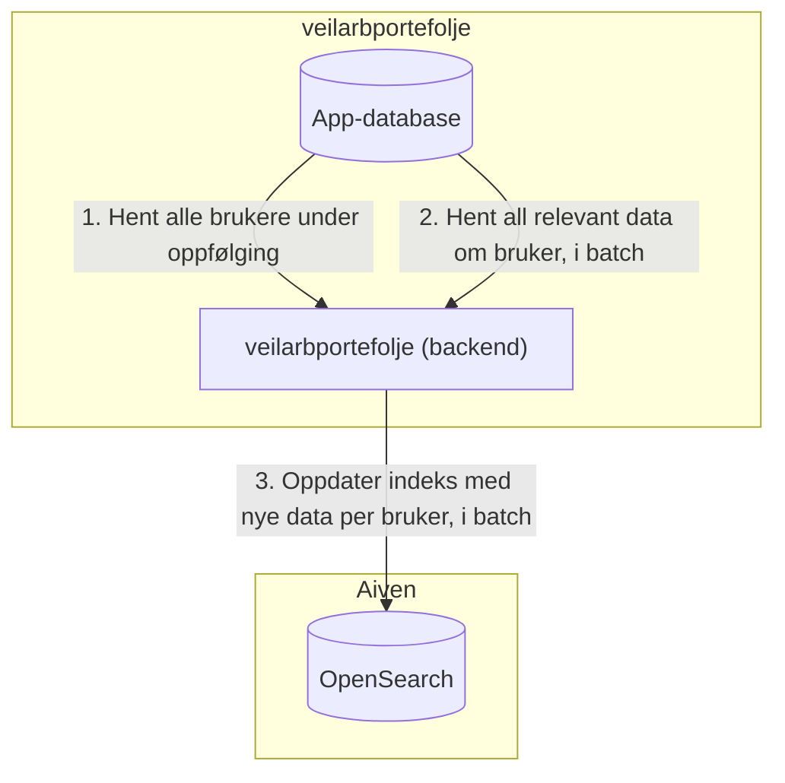
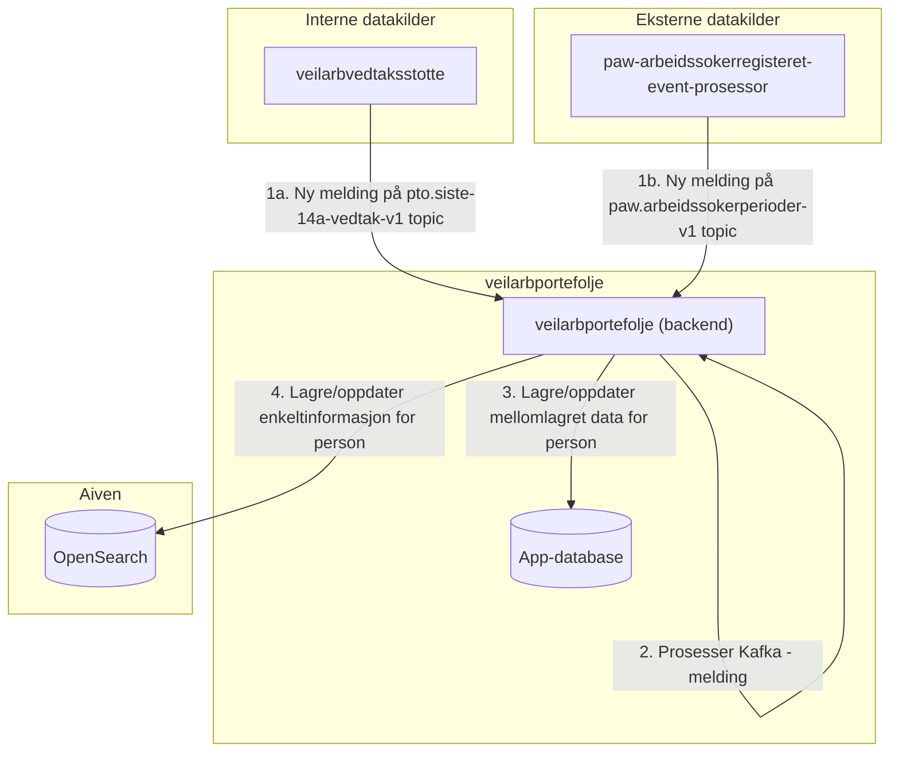
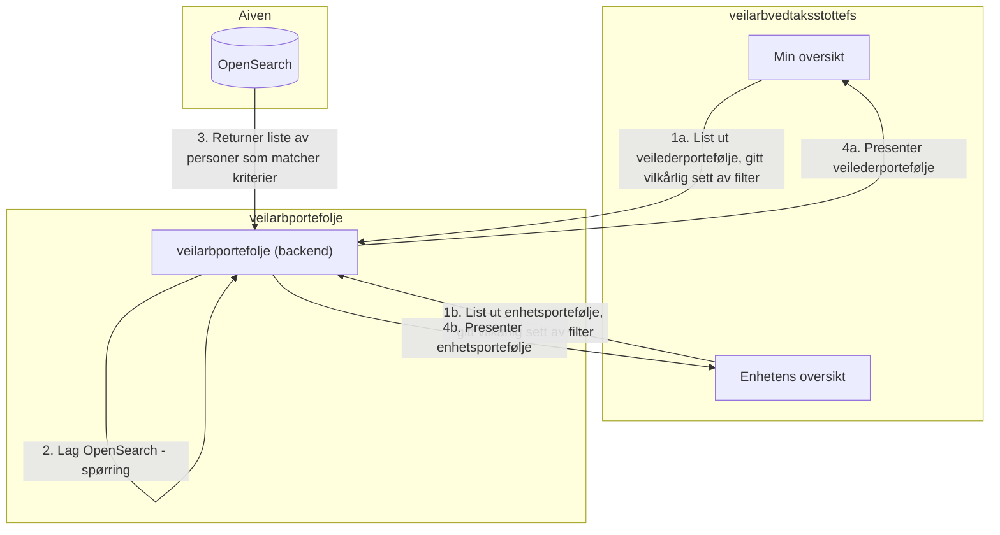

# Søkemotor

I veilarbportefolje brukes OpenSearch (søkemotor) aktivt for å lagre, indeksere og spørre (querye) etter data om
personer under arbeidsrettet oppfølging. OpenSearch er således selve ryggraden i enhver veileder- og enhetsportefølje.

Formålet med dette dokumentet er å beskrive litt mer i detalj hvordan vi bruker OpenSearch.

## Begreper

| Begrep           | Beskrivelse                                                                                                                                                                                                                                                                                                                                                                                                                                                       |
|------------------|-------------------------------------------------------------------------------------------------------------------------------------------------------------------------------------------------------------------------------------------------------------------------------------------------------------------------------------------------------------------------------------------------------------------------------------------------------------------|
| indeksere        | Når vi skriver til/oppdaterer/sletter et dokument i OpenSearch sier vi som regel at vi "indekserer" en bruker. I praksis er det internt i OpenSearch at selve indekseringen (oppdatering av indekser, mm.) skjer. Å "indeksere" har etterhvert blitt et vanlig verb å benytte i dagligtale.                                                                                                                                                                       |
| hovedindeksering | Nattlig jobb som itererer over alle personer under oppfølging og indekserer med ferske data. I praksis er det flere jobber som kjører hver natt, så når vi bruker begrepet "hovedindeksering" refererer vi som regel til kombinasjonen av disse jobbene. "Døgnlig indeksering av alle personer/data" kunne vært en mer konkret måte å beskrive det samme på.                                                                                                      |
| brukerindeks     | Aliaset vi bruker når vi refererer til den indeksen som til enhver tid er "master". I OpenSearch har indeksene til dels genererte navn (`brukerindeks_<generert_del>`). Noen ganger får vi ny indeks, f.eks. når vi oppdaterer `opensearch_settings.json` og/eller gjør en "aliasbasert hovedindeksering". I slike tilfeller vil vi peke "brukerindeks"-aliaset til den nye indeksen når jobben er ferdig, slik at appen kun trenger å forholde seg til aliaset.  |

## Dataflyt: overordnet

Noen kommentarer om figurene:

* "Aiven" er tjenestetilbyder for managed OpenSearch
* Med "interne" datakilder menes datakilder som vi eier selv
* Med "eksterne" datakilder menes datakilder som vi ikke eier selv

### Hovedindeksering

### Løpende oppdateringer (indeksering av enkeltinformasjon)

### Henting av veileder-/enhetsportefølje

## Datamodeller

Her listes kun noen av de mest essensielle datamodellene.

| Navn                                                                                                                                      | Beskrivelse                                                                                                                                                                                                                                                                                                                                  |
|-------------------------------------------------------------------------------------------------------------------------------------------|----------------------------------------------------------------------------------------------------------------------------------------------------------------------------------------------------------------------------------------------------------------------------------------------------------------------------------------------|
| [PortefoljebrukerOpensearchModell](../src/main/java/no/nav/pto/veilarbportefolje/opensearch/domene/PortefoljebrukerOpensearchModell.java) | Representerer en enkelt person som er under arbeidsrettet oppfølging og tilhørende opplysninger/attributter for denne personen som sendes til OpenSearch. Majoriteten av opplysningene her er identiske med PortefoljebrukerFrontendModell, men denne modellen inneholder også noen opplysninger som utelukkende brukes i filtreringsøyemed. |
| [PortefoljebrukerFrontendModell](../src/main/java/no/nav/pto/veilarbportefolje/domene/frontendmodell/PortefoljebrukerFrontendModell.kt)   | Representerer en enkelt person som er under arbeidsrettet oppfølging og tilhørende opplysninger/attributter for denne personen som sendes til frontend. I stor grad er dette 1-til-1 mappinger fra PortefoljebrukerOpensearchModell.                                                                                                         |
| [Filtervalg](../src/main/java/no/nav/pto/veilarbportefolje/domene/filtervalg/Filtervalg.java)                                             | Hvilke attributter/opplysninger som er mulig å filtrere på. Filtrering fungerer primært ved at bare personer i enten veileders- eller enhetsporteføljen som matcher kriteriene returneres ved spørring mot OpenSearch. Kombinasjoner av filter er tillatt.                                                                                   |
| [Hits](../src/main/java/no/nav/pto/veilarbportefolje/opensearch/domene/Hits.java)                                                         | Representerer responsen fra en OpenSearch-spørring. Selve dataen (en instans av `PortefoljebrukerOpensearchModell`) ligger under `Hits.hits._source`.                                                                                                                                                                                        |

## Prosesser

### Kritiske prosesser

I veilarbportefolje er det primært tre kritiske prosesser som må fungere for at veileder- og enhetsporteføljene til
enhver tid skal gi oppdatert og riktig informasjon:

| Tittel                                             | Beskrivelse                                                                                                                                                                                                                                                                                                                                                                                                                                      | Konsekvenser ved feil i prosessen                                                                                                                                                           | Detaljer                       |
|----------------------------------------------------|--------------------------------------------------------------------------------------------------------------------------------------------------------------------------------------------------------------------------------------------------------------------------------------------------------------------------------------------------------------------------------------------------------------------------------------------------|---------------------------------------------------------------------------------------------------------------------------------------------------------------------------------------------|--------------------------------|
| Holde populasjonen oppdatert                       | Det er bare personer som er under arbeidsrettet oppfølging som skal være en del av populasjonen, dvs. hvilke personer vi skal ha i løsningen. Her er det Kafka-topicet `pto.siste-oppfolgingsperiode-v1` som er masterkilde for hvilke personer som er under arbeidsrettet oppfølging.                                                                                                                                                           | De enkelte veileder- og enhetsporteføljene vil ikke gjenspeile virkeligheten. I verste fall kan personer som har rett på arbeidsrettet oppfølging ikke bli fanget opp av en enhet/veileder. | [POPULASJON.md](POPULASJON.md) |
| Løpende oppdatering av opplysninger                | veilarbportefolje eier lite av daten selv - dataene er primært aggregerte opplysninger om personene i populasjonen som stammer fra mange ulike datakilder. Dataene i de bakomforliggende kildene kan endres på vilkårlige tidspunkt, og det er derfor avgjørende at vi oppdaterer vår mellomlagrede tilstand uten unødig opphold. Dette håndteres ved at vi konsumerer data fra Kafka-topics og umiddelbart oppdaterer søkemotoren med nye data. | Opplysningene som veiledere ser om personer i de enkelte veileder- og enhetsporteføljene gjenspeiler ikke virkeligheten/er utdatert/er feil.                                                |                                |
| Re-kalkulering av opplysninger som avhenger av tid | Et konkret eksempel er "neste kommende møte med en person": det kan være flere planlagte møter, og denne tilstanden må derfor re-kalkuleres døgnlig slik at vi hele tiden viser rett. Dette håndteres vha. schedulerte jobber som kjøres ved faste tidspunkt hver natt og itererer over samtlige personer i populasjonen og oppdaterer alle opplysninger i OpenSearch.                                                                           | Opplysningene som veiledere ser om personer i de enkelte veileder- og enhetsporteføljene gjenspeile ikke virkeligheten/er utdatert.                                                         |                                |

